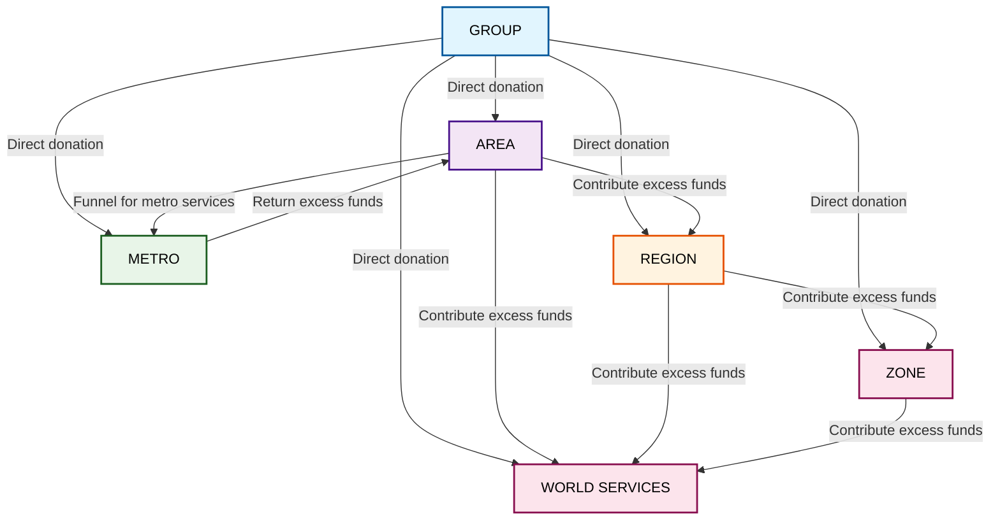

# Diagrams

### Fund Flow

```mermaid
flowchart TD
    GROUP[GROUP]
    AREA[AREA]
    METRO[METRO]
    REGION[REGION]
    ZONE[ZONE]
    WORLD[WORLD SERVICES]

%% Direct donations from groups
    GROUP -->|Direct donation| AREA
    GROUP -->|Direct donation| METRO
    GROUP -->|Direct donation| REGION
    GROUP -->|Direct donation| ZONE
    GROUP -->|Direct donation| WORLD

%% Fund flow through hierarchy
    AREA -->|Funnel for metro services| METRO
    METRO -->|Return excess funds| AREA
    AREA -->|Contribute excess funds| REGION
    AREA -->|Contribute excess funds| WORLD
    REGION -->|Contribute excess funds| ZONE
    REGION -->|Contribute excess funds| WORLD
    ZONE -->|Contribute excess funds| WORLD
    
%% Styling
    classDef groupStyle fill:#e1f5fe,stroke:#01579b,color:#000,stroke-width:2px
    classDef areaStyle fill:#f3e5f5,stroke:#4a148c,color:#000,stroke-width:2px
    classDef metroStyle fill:#e8f5e8,stroke:#1b5e20,color:#000,stroke-width:2px
    classDef regionStyle fill:#fff3e0,stroke:#e65100,color:#000,stroke-width:2px
    classDef worldStyle fill:#fce4ec,stroke:#880e4f,color:#000,stroke-width:2px
    classDef zoneStyle fill:#fce4ec,stroke:#880e4f,color:#000,stroke-width:2px

    class GROUP groupStyle
    class AREA areaStyle
    class METRO metroStyle
    class REGION regionStyle
    class WORLD worldStyle
    class ZONE zoneStyle
```
