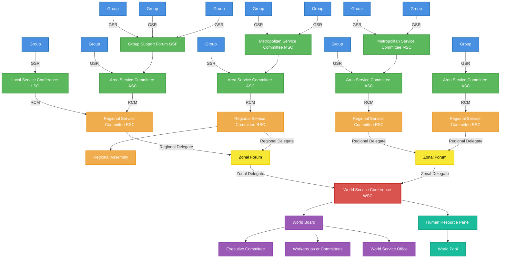
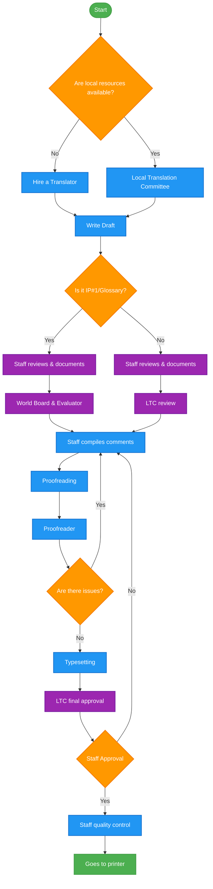
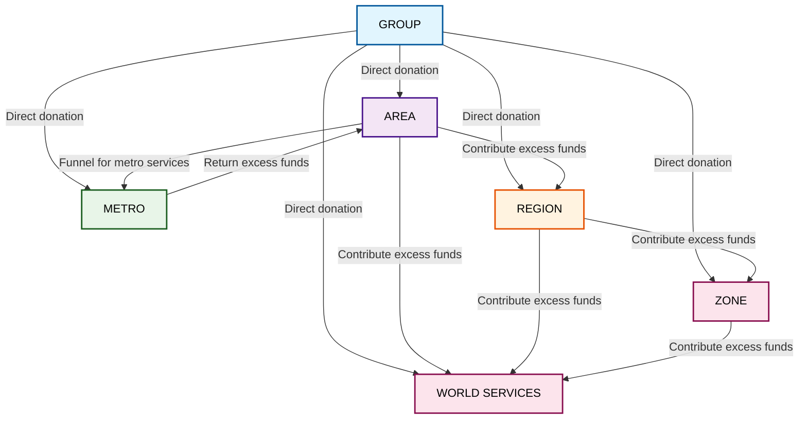
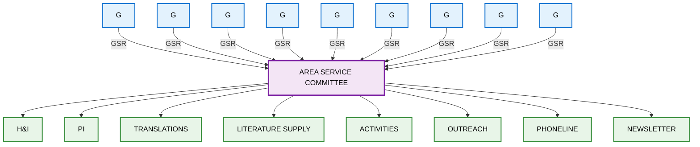
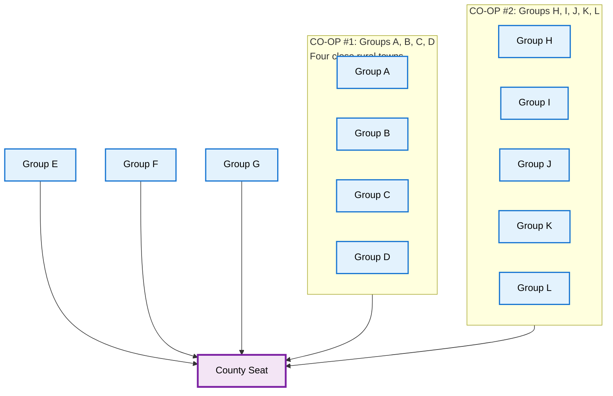
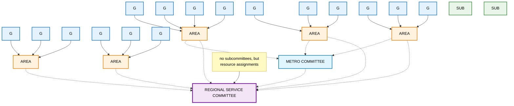
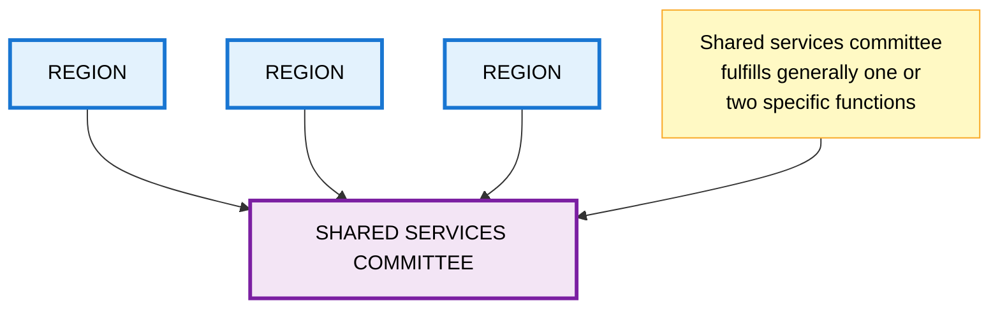

# Diagrams

### Service Structure Diagram

### Translations Process

### Fund Flow

## Area Service Committee

### Rural Area with CO-OPS

### Area Shared Services Committee

```mermaid
flowchart TD
    %% Groups for each area
    G1A[G] 
    G2A[G]
    G3A[G]
    
    G1B[G]
    G2B[G]
    G3B[G]
    G4B[G]
    
    G1C[G]
    G2C[G]
    
    G1D[G]
    G2D[G]
    
    G1E[G]
    G2E[G]
    
    %% Areas and their subcommittees
    AREA1[AREA]
    SUB1[SUB]
    
    AREA2[AREA]
    SUB2[SUB]
    
    AREA3[AREA]
    SUB3[SUB]
    
    AREA4[AREA]
    SUB4[SUB]
    
    AREA5[AREA]
    SUB5[SUB]
    
    %% Shared Services Committee
    SSC[SHARED SERVICES COMMITTEE]
    
    %% Note box
    NOTE["Shared services committee<br/>fulfills generally one or<br/>two specific functions"]
    
    %% Groups to Areas
    G1A --> AREA1
    G2A --> AREA1
    G3A --> AREA1
    
    G1B --> AREA2
    G2B --> AREA2
    G3B --> AREA2
    G4B --> AREA2
    
    G1C --> AREA3
    G2C --> AREA3
    
    G1D --> AREA4
    G2D --> AREA4
    
    G1E --> AREA5
    G2E --> AREA5
    
    %% Areas to Shared Services Committee
    AREA1 --> SSC
    AREA2 --> SSC
    
    %% Note connection
    NOTE --> SSC
    
    %% Styling
    classDef groupStyle fill:#e3f2fd,stroke:#1976d2,stroke-width:2px,color:#000
    classDef areaStyle fill:#fff3e0,stroke:#f57c00,stroke-width:2px,color:#000
    classDef subStyle fill:#e8f5e8,stroke:#388e3c,stroke-width:2px,color:#000
    classDef sscStyle fill:#f3e5f5,stroke:#7b1fa2,stroke-width:3px,color:#000
    classDef noteStyle fill:#fff9c4,stroke:#f9a825,stroke-width:1px,color:#000
    
    class G1A,G2A,G3A,G1B,G2B,G3B,G4B,G1C,G2C,G1D,G2D,G1E,G2E groupStyle
    class AREA1,AREA2,AREA3,AREA4,AREA5 areaStyle
    class SUB1,SUB2,SUB3,SUB4,SUB5 subStyle
    class SSC sscStyle
    class NOTE noteStyle
```

### Regional Service Modal

### Regional Committee

```mermaid
flowchart TD
    %% Groups for each area
    G1A[G] 
    G2A[G]
    G3A[G]
    G4A[G]
    
    G1B[G]
    G2B[G]
    G3B[G]
    
    G1C[G]
    G2C[G]
    G3C[G]
    
    G1D[G]
    G2D[G]
    G3D[G]
    
    G1E[G]
    G2E[G]
    G3E[G]
    
    %% Areas and their subcommittees
    AREA1[AREA]
    SUB1[SUB]
    
    AREA2[AREA]
    SUB2[SUB]
    
    AREA3[AREA]
    SUB3[SUB]
    
    AREA4[AREA]
    SUB4[SUB]
    
    AREA5[AREA]
    SUB5[SUB]
    
    %% Regional Service Committee and subcommittees
    RSC[REGIONAL SERVICE COMMITTEE]
    RSO[RSO]
    CONV[CONV.]
    HI[H&I]
    PI[PI]
    
    %% Regional Assembly
    RA[REGIONAL ASSEMBLY]
    
    %% Note
    NOTE["Event attended<br/>by all GSRs, RCMs"]
    
    %% Groups to Areas
    G1A --> AREA1
    G2A --> AREA1
    G3A --> AREA1
    G4A --> AREA1
    
    G1B --> AREA2
    G2B --> AREA2
    G3B --> AREA2
    
    G1C --> AREA3
    G2C --> AREA3
    G3C --> AREA3
    
    G1D --> AREA4
    G2D --> AREA4
    G3D --> AREA4
    
    G1E --> AREA5
    G2E --> AREA5
    G3E --> AREA5
    
    %% Areas send RCMs to Regional Service Committee
    AREA1 -->|RCM| RSC
    AREA2 -->|RCM| RSC
    AREA3 -->|RCM| RSC
    AREA4 -->|RCM| RSC
    AREA5 -->|RCM| RSC
    
    %% Regional subcommittees
    RSO --> RSC
    CONV --> RSC
    HI --> RSC
    PI --> RSC
    
    %% Regional Assembly connection
    RSC --> RA
    NOTE --> RA
    
    %% Styling
    classDef groupStyle fill:#e3f2fd,stroke:#1976d2,stroke-width:2px,color:#000
    classDef areaStyle fill:#fff3e0,stroke:#f57c00,stroke-width:2px,color:#000
    classDef subStyle fill:#e8f5e8,stroke:#388e3c,stroke-width:2px,color:#000
    classDef rscStyle fill:#f3e5f5,stroke:#7b1fa2,stroke-width:3px,color:#000
    classDef raStyle fill:#ffebee,stroke:#c62828,stroke-width:3px,color:#000
    classDef noteStyle fill:#263238,stroke:#37474f,stroke-width:1px,color:#fff
    
    class G1A,G2A,G3A,G4A,G1B,G2B,G3B,G1C,G2C,G3C,G1D,G2D,G3D,G1E,G2E,G3E groupStyle
    class AREA1,AREA2,AREA3,AREA4,AREA5 areaStyle
    class SUB1,SUB2,SUB3,SUB4,SUB5 subStyle
    class RSC,RSO,CONV,HI,PI rscStyle
    class RA raStyle
    class NOTE noteStyle
```

### Regional Shared Services Committee

