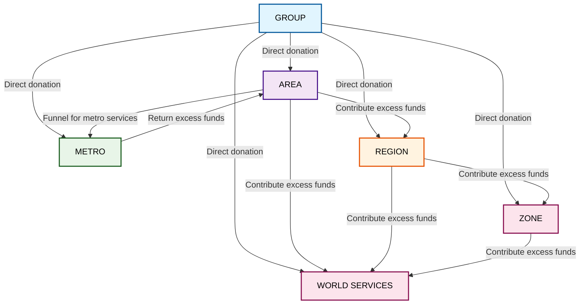
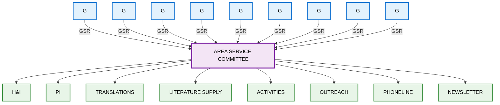

# Diagrams

### Fund Flow

```mermaid
flowchart TD
    GROUP[GROUP]
    AREA[AREA]
    METRO[METRO]
    REGION[REGION]
    ZONE[ZONE]
    WORLD[WORLD SERVICES]

%% Direct donations from groups
    GROUP -->|Direct donation| AREA
    GROUP -->|Direct donation| METRO
    GROUP -->|Direct donation| REGION
    GROUP -->|Direct donation| ZONE
    GROUP -->|Direct donation| WORLD

%% Fund flow through hierarchy
    AREA -->|Funnel for metro services| METRO
    METRO -->|Return excess funds| AREA
    AREA -->|Contribute excess funds| REGION
    AREA -->|Contribute excess funds| WORLD
    REGION -->|Contribute excess funds| ZONE
    REGION -->|Contribute excess funds| WORLD
    ZONE -->|Contribute excess funds| WORLD
    
%% Styling
    classDef groupStyle fill:#e1f5fe,stroke:#01579b,color:#000,stroke-width:2px
    classDef areaStyle fill:#f3e5f5,stroke:#4a148c,color:#000,stroke-width:2px
    classDef metroStyle fill:#e8f5e8,stroke:#1b5e20,color:#000,stroke-width:2px
    classDef regionStyle fill:#fff3e0,stroke:#e65100,color:#000,stroke-width:2px
    classDef worldStyle fill:#fce4ec,stroke:#880e4f,color:#000,stroke-width:2px
    classDef zoneStyle fill:#fce4ec,stroke:#880e4f,color:#000,stroke-width:2px

    class GROUP groupStyle
    class AREA areaStyle
    class METRO metroStyle
    class REGION regionStyle
    class WORLD worldStyle
    class ZONE zoneStyle
```

## Area Service Committee

```mermaid
flowchart TD
    G1[G]
    G2[G]
    G3[G]
    G4[G]
    G5[G]
    G6[G]
    G7[G]
    G8[G]
    G9[G]
    
    ASC[AREA SERVICE COMMITTEE]
    
    HI[H&I]
    PI[PI]
    TRANS[TRANSLATIONS]
    LIT[LITERATURE SUPPLY]
    ACT[ACTIVITIES]
    OUT[OUTREACH]
    PHONE[PHONELINE]
    NEWS[NEWSLETTER]
    
    %% Groups send GSRs to Area Service Committee
    G1 -->|GSR| ASC
    G2 -->|GSR| ASC
    G3 -->|GSR| ASC
    G4 -->|GSR| ASC
    G5 -->|GSR| ASC
    G6 -->|GSR| ASC
    G7 -->|GSR| ASC
    G8 -->|GSR| ASC
    G9 -->|GSR| ASC
    
    %% Area Service Committee oversees subcommittees
    ASC --> HI
    ASC --> PI
    ASC --> TRANS
    ASC --> LIT
    ASC --> ACT
    ASC --> OUT
    ASC --> PHONE
    ASC --> NEWS
    
    %% Styling
    classDef groupStyle fill:#e3f2fd,stroke:#1976d2,stroke-width:2px,color:#000
    classDef ascStyle fill:#f3e5f5,stroke:#7b1fa2,stroke-width:3px,color:#000
    classDef subcommitteeStyle fill:#e8f5e8,stroke:#388e3c,stroke-width:2px,color:#000
    
    class G1,G2,G3,G4,G5,G6,G7,G8,G9 groupStyle
    class ASC ascStyle
    class HI,PI,TRANS,LIT,ACT,OUT,PHONE,NEWS subcommitteeStyle
```
